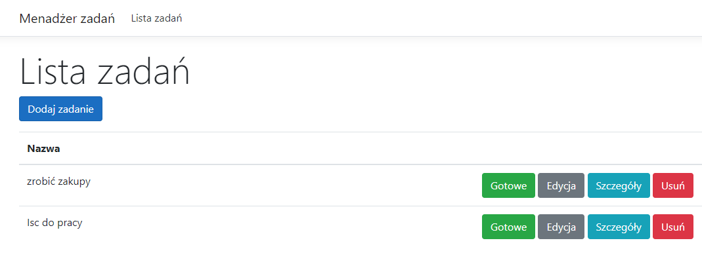
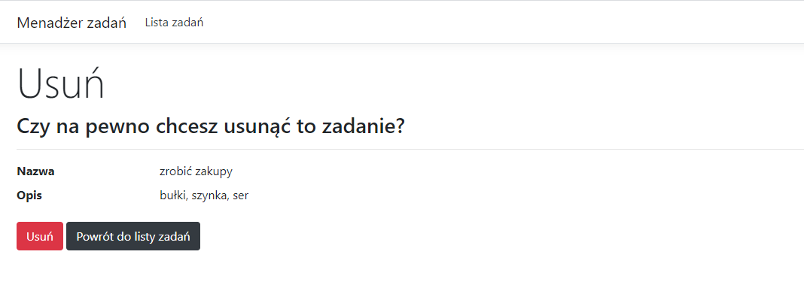

# TaskManager - web app
## Table of contents
* [General info](#General-info)
* [Features](#features)
* [Screenshots](#Screenshots)
* [Technologies](#Technologies)
* [Sources](#Sources)
## General info
Web task manager created to learn how to write simple apps.
## Features
* With this app you can manage your tasks during the day.
## Screenshots

## Technologies
Project is created with:
* .NET 5.0.3
* Entity Framework Core
* Bootstrap
## Sources
This app is based on Jak Zostać Programistą dotNET Tutorial on Youtube.

